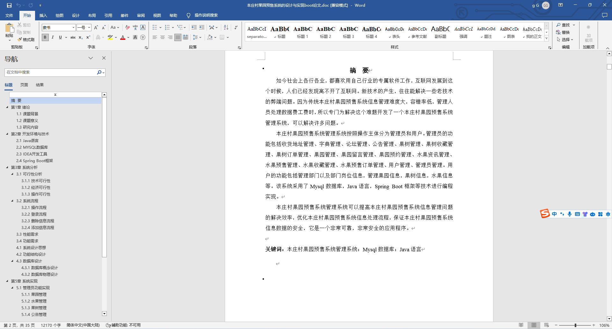
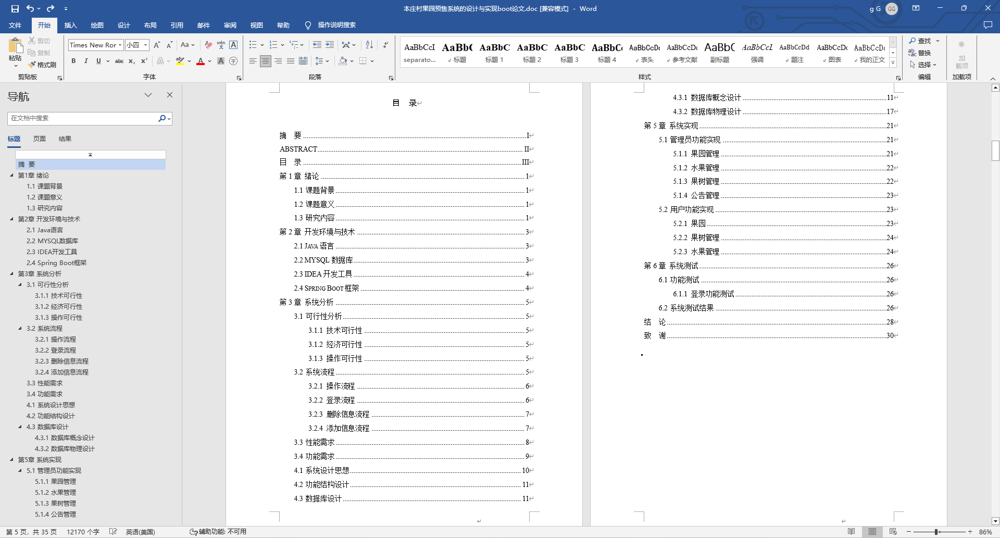
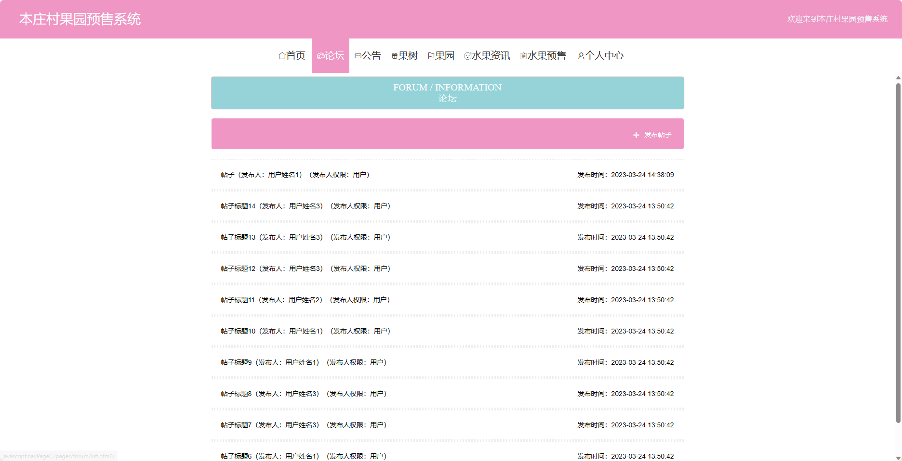
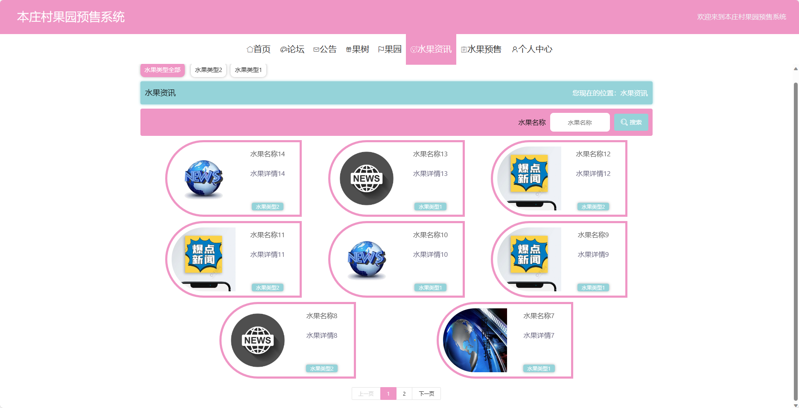
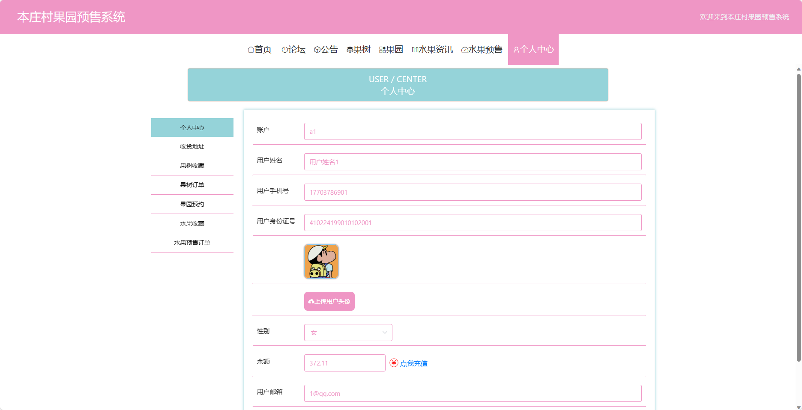
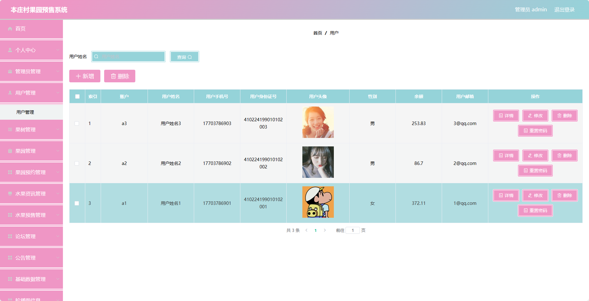
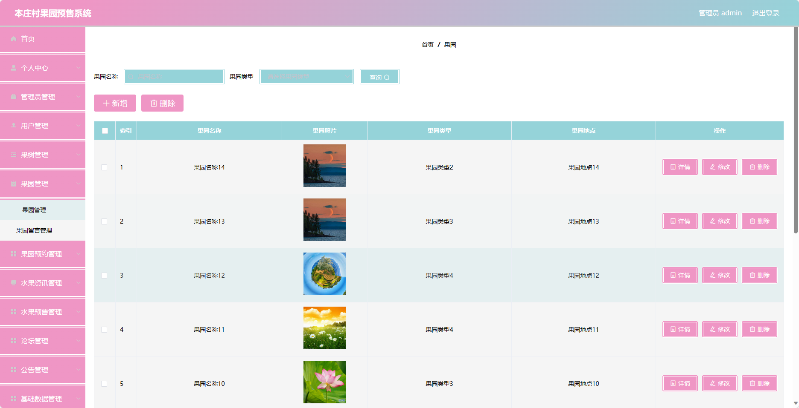

基于SpringBoot的本庄村果园预售系统（程序+论文）
=
- 完整代码获取地址：从戎源码网 ([https://armycodes.com/](https://armycodes.com/))
- 作者微信：19941326836  QQ：952045282 
- 承接计算机毕业设计、Java毕业设计、Python毕业设计、深度学习、机器学习
- 选题+开题报告+任务书+程序定制+安装调试+论文+答辩ppt 一条龙服务
- 所有选题地址https://github.com/nature924/allProject

一、项目介绍
---
基于Spring Boot框架实现的本庄村果园预售系统，系统包含两种角色：管理员、用户,系统分为前台和后台两大模块，主要功能如下。

### 前台：
- 首页：展示果园的基本信息和热门活动等内容。
- 论坛：提供用户交流和分享的平台，用户可以发布帖子、回复帖子等。
- 公告：展示果园的最新公告和通知。
- 果树：展示果园中各种果树的信息，包括品种、产量、价格等。
- 果园：展示果园的地理位置、面积、特色等信息。
- 水果资讯：提供水果产业的相关资讯、新闻和动态。
- 水果预售：用户可以在系统中进行水果的预售操作。
- 个人中心：用户可以管理个人信息、查看订单历史等。

### 后台：
- 管理员个人中心：管理员可以管理个人信息，包括修改密码、查看个人信息等。
- 管理员管理：管理员可以管理其他管理员账号，包括添加、删除、编辑等操作。
- 用户管理：管理员可以管理用户账号，包括查看用户列表、禁用用户等操作。
- 果树管理：管理员可以管理果树的信息，包括添加、删除、编辑等操作。
- 果园管理：管理员可以管理果园的信息，包括添加、删除、编辑等操作。
- 果园预约管理：管理员可以管理用户对果园的预约操作，包括查看预约列表、处理预约等操作。
- 水果资讯管理：管理员可以管理水果资讯的发布，包括添加、删除、编辑等操作。
- 水果预售管理：管理员可以管理水果的预售信息，包括查看预售列表、处理预售订单等操作。
- 论坛管理：管理员可以管理论坛的帖子，包括删除帖子、置顶帖子等操作。
- 公告管理：管理员可以管理公告的发布，包括添加、删除、编辑等操作。
- 基础数据管理：管理员可以管理系统的基础数据，如果树种类、果园地理位置等。
- 轮播图信息：管理员可以管理首页轮播图的展示内容。

二、项目技术
---
- 编程语言：Java
- 数据库：MySQL
- 项目管理工具：Maven
- 前端技术：VUE、HTML、Jquery、Bootstrap
- 后端技术：Spring、SpringMVC、MyBatis

三、运行环境
---
- 操作系统：Windows、macOS都可以
- JDK版本：JDK1.8以上都可以
- 开发工具：IDEA、Ecplise、Myecplise都可以
- 数据库: MySQL5.7以上都可以
- Tomcat：任意版本都可以
- Maven：任意版本都可以

四、运行截图
---
### 论文截图：

### 程序截图：

